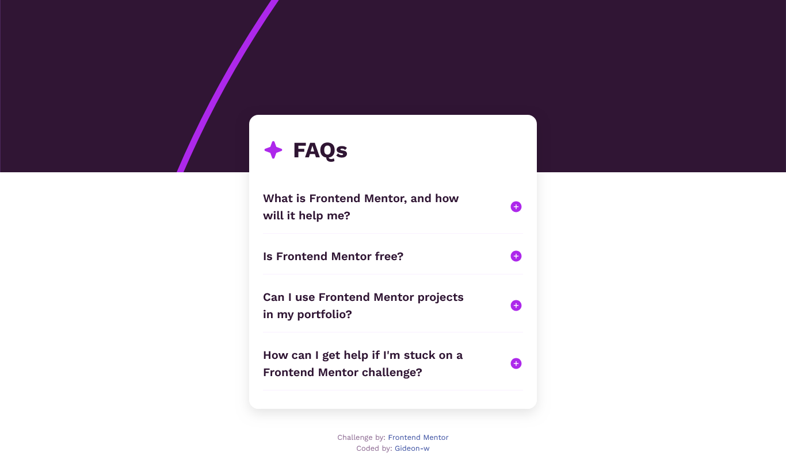

# Frontend Mentor - FAQ accordion solution

This is a solution to the [FAQ accordion challenge on Frontend Mentor](https://www.frontendmentor.io/challenges/faq-accordion-wyfFdeBwBz). Frontend Mentor challenges help you improve your coding skills by building realistic projects.

## Table of contents

- [Frontend Mentor - FAQ accordion solution](#frontend-mentor---faq-accordion-solution)
  - [Table of contents](#table-of-contents)
  - [Overview](#overview)
    - [The challenge](#the-challenge)
    - [Screenshot](#screenshot)
    - [Links](#links)
  - [My process](#my-process)
    - [Built with](#built-with)
    - [What I learned](#what-i-learned)
    - [Useful resources](#useful-resources)
  - [Author](#author)

## Overview

### The challenge

Users should be able to:

- Hide/Show the answer to a question when the question is clicked
- Navigate the questions and hide/show answers using keyboard navigation alone
- View the optimal layout for the interface depending on their device's screen size
- See hover and focus states for all interactive elements on the page

### Screenshot



### Links

- Solution URL: [(https://github.com/Gideon-w/Frontend-Mentor---FAQ-accordion-solution/](https://github.com/Gideon-w/Frontend-Mentor---FAQ-accordion-solution/)
- Live Site URL: [https://gideon-w.github.io/Frontend-Mentor---FAQ-accordion-solution/]([https://gideon-w.github.io/faq-accordion/](https://gideon-w.github.io/Frontend-Mentor---FAQ-accordion-solution/))

## My process

### Built with

- Semantic HTML5
- CSS custom properties
- Flexbox
- Mobile-first workflow

### What I learned

- How to use the `<details>` and `<summary>` elements to build accessible accordion components.
- How to use JavaScript to dynamically update icons based on toggle state.
- Refined my understanding of color themes and hover/active states using CSS custom properties.

```js
document.querySelectorAll("details").forEach((detail) => {
  const summary = detail.querySelector("summary");
  const icon = summary.querySelector(".faq-icon");

  detail.addEventListener("toggle", () => {
    icon.src = detail.hasAttribute("open")
      ? "./assets/images/icon-minus.svg"
      : "./assets/images/icon-plus.svg";
  });
});
```

### Useful resources

- [CSS Tricks - Details and Summary Elements](https://css-tricks.com/two-issues-styling-the-details-element/)
- [MDN Web Docs - HTML <details>](https://developer.mozilla.org/en-US/docs/Web/HTML/Element/details)

## Author

- Frontend Mentor - [@Gideon-w](https://www.frontendmentor.io/profile/Gideon-w)
- GitHub - [@Gideon-w](https://github.com/Gideon-w)
